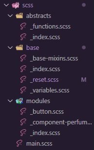

<h1 align="center">Product preview card component
</h1>

&nbsp;


<h2 align="center"> 
	🚧 Product preview card component 🟢 Completed 🚀 🚧
  
</h2>

&nbsp;

<!--
## Table of contents

- [Project description](#description) - [What I learned](#What-I-learned) -->

<h2 id="#description">Project description 📚</h2>

This is a solution to the challenge
[Product preview card component](https://www.frontendmentor.io/challenges/product-preview-card-component-GO7UmttRfa).

This is a challenge from the Mentor frontend site, where I could put into practice my knowledge with SASS/SCSS, such as smacss architecture, variables, mixins, and Parent Selector.

<a href="https://www.frontendmentor.io/challenges?difficulties=4"></a>

&nbsp;

## What I learned

smacss architecture, I treated this project as just one component, so I only used those repositories and partials.



I also used parent Selector, mixins and include to make the project responsive

```css
 &__img {
    border-radius: rem(8) 0 0 rem(8);
    object-fit: cover;
    object-position: right;

    @include screen-560 {
      border-radius: rem(8) rem(8) 0 0;
    }
  }

  &__content {
    padding: rem(32);
    background-color: $white;
    border-radius: 0 rem(8) rem(8) 0;

    @include screen-560 {
      border-radius: 0 0 rem(8) rem(8);
      padding: rem(24);
    }

```

I also used the rem() function to convert px to rem, you can read more about this function in this article by - [Vanza Setia](https://community.codenewbie.org/vanzasetia/5-handy-sass-code-snippets-42ae)

```scss
@use "sass:math";

@function rem($value) {
  @if unitless($value) {
    $default-pixel: 16;

    @return calc($value / $default-pixel) * 1rem;
  }

  @error "Sorry, this '#{$value}' must have not any unit";
}
```

## Links

- [Preview Site](https://viniciusshenri96.github.io/product-preview-card-component/)
<!-- - [Frontend Mentor Solution Page](https://www.frontendmentor.io/solutions/challenge-completed-with-htmlcssleaflet-jsgrid-and-responsive--kw3kKedNp) -->

&nbsp;

## My process

### Built with

- [HTML](https://developer.mozilla.org/en-US/docs/Web/HTML)
- [CSS](https://developer.mozilla.org/en-US/docs/Web/CSS)
- [SCSS](https://sass-lang.com)

&nbsp;

## Responsive 📱 - Mobile/Tablet/Desktop

<!-- ### Mobile - 375px -->

<!-- ### Tablet - 768px -->

<span>
  
</span>
<span>
   
</span>
<span>
  
</span>
<!-- ### Desktop - 1440px -->

&nbsp;

## 👨‍💻 Author

- [Frontend Mentor](https://www.frontendmentor.io/profile/viniciusshenri96)
- [Linkedin](https://www.linkedin.com/in/vinícius-henrique-7a2533229/)
